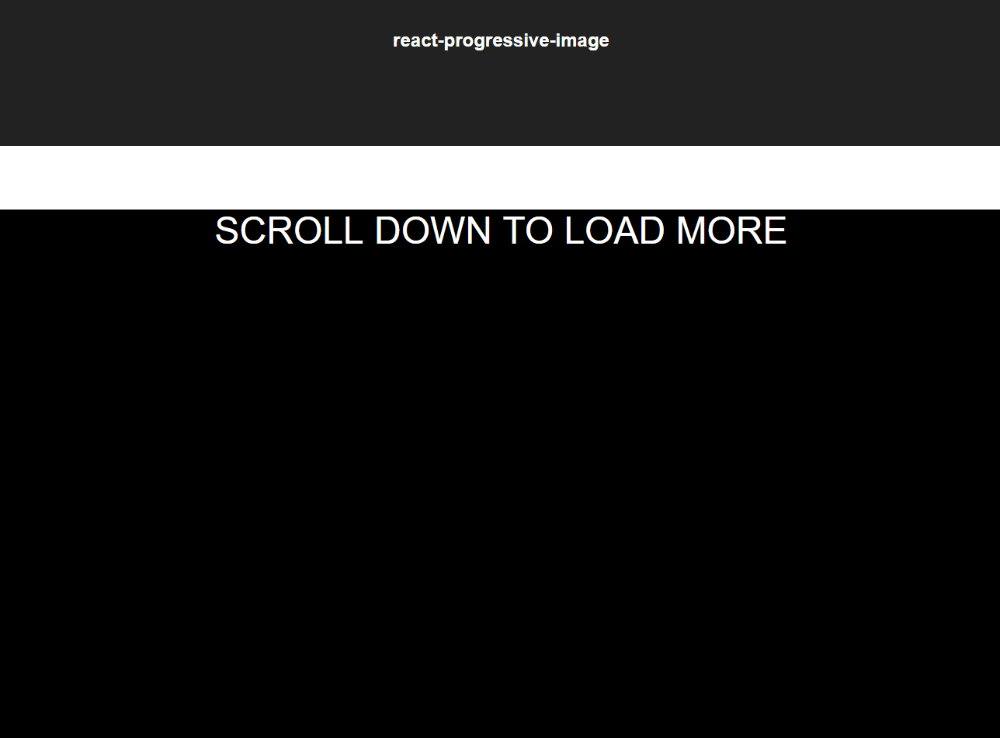
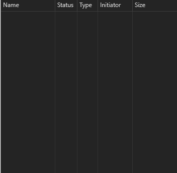

react-progressive-image-blur (alpha version)
=======================
Preview

Requests

Load images progressively with blur transitions like [Medium](https://medium.com/)

this module can also work with [next](https://github.com/zeit/next.js/)

Install
--------
`npm install react-progressive-image-blur`

or

`yarn add react-progressive-image-blur`

Features
--------

 - Blur transition
 - Load images only when it appears inside view port
 - Load different resolutions according to the width

Issues
------

 - Currently the blur performance is not very good, the bigger area you have the slower the blur animation performs, if you can help to improve that, feel free to have a PR
 - Some codes are still not will designed, written, documented and tested, will continue to improve that as well

Credits
-------

 - [Super Fast Blur](http://www.quasimondo.com/BoxBlurForCanvas/FastBlurDemo.html) : The blur effects are implemented by [Mario KlingemannVerified](https://twitter.com/Quasimondo) 's Super Fast Blur library with a little bit modified.

How to use
----------
**Prepare different images for progressive image loading**

This module accepts a prop named `imgResolution`, it accepts a resolution list for a resolution list, defaults to the following:

    {
      50: '-w50',
      200: '-w200',
      630: '-w630',
      1180: '-o'
    }

the key will be the width, and the correspondent value will be the suffix of the file. For example: when you use this module, you give a `src` prop indicates the original image `https://awesome-website.me/profile.png`, in the initial load, the module will find the smallest resolution as a thumbnail, so in the initial load, the module will request `https://awesome-website.me/profile-w50.png`. And next, according to the current width, lets say you have a style sets it to 300px, which 200 in the provided list is closest to 300px, so the module will request `https://awesome-website/profile-w200.png` and show it.
(You can see the request process above)

**Using Gulp and gulp-responsive to produce different images**
You can see the [gulp-responsive](https://github.com/mahnunchik/gulp-responsive) example in `example`

**Using it in your projects**
Basic usage

    import React, {Component} from 'react'
    import {DeferImg, DeferImgSettings} from 'react-progressive-image-blur'
    // if you want to supply your own resolution list
    // call DeferImgSettings
    DeferImgSettings({resolution:{10:'-thumb',1180:'-original'}})

    export default class MyApp extends Component {
	    constructor(props) {
		    super(props)
		}
		render() {
			return (
				<DeferImg src="/profile.png" alt="My profile avatar" />
			)
		}
    }

**What props will DeferImg accepts**
Currently the module only accepts a limited set of custom settings

 - `src` **(MUST)** the original image source without any suffix
 - `alt` alternative text for `` tag
 - `className`class names for the module
 - `figcaption`If set, will append a `<figcaption>` tag after ``

**What settings will DeferImgSettings accepts**
Currently only accepts a `resolution` to set your own resolution list
